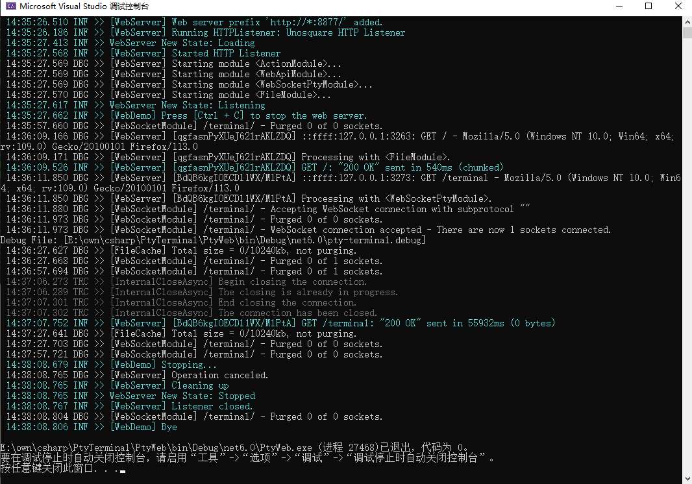

[](https://www.nuget.org/packages/PTY/)

# PtyTerminal

**English** | [简体中文](./README_zh.md)

cross platform [Pseudo Terminal (PTY)](https://en.wikipedia.org/wiki/Pseudoterminal) Library and Usage Demos in .NET(C#)

## Projects
#### **Pty.Net**  cross platform [Pseudo Terminal (PTY)](https://en.wikipedia.org/wiki/Pseudoterminal) Library in .NET(C#). Modified from [microsoft/vs-pty.net](https://github.com/microsoft/vs-pty.net/tree/main/src/Pty.Net) and inspired by [WindowsGSM/SteamCMD.ConPTY](https://github.com/WindowsGSM/SteamCMD.ConPTY/tree/main/SteamCMD.ConPTY).
- Compatibility with `ConPTY` and `winpty` on Windows Platform
- P/Invoke APIs (`forkpty` `ioctl` `kill` ...) on Unix Platforms
    - APIs provided by `libc.so.6` and `libutil.so.1` for Linux
    - APIs provided by `libSystem.dylib` for MacOs
#### **PtyWeb**
- **CliDemo** Console demo to use Pty.Net

- **WebDemo** Web demo to use Pty.Net, powered by [EmbedIO](https://github.com/unosquare/embedio) and [Xterm.js](https://github.com/xtermjs/xterm.js/)    



#### Tips
- modify `Program.cs` to switch which Demo to run:
    ```csharp
    namespace PtyWeb
    {
        class Program
        {
            static void Main(string[] args)
            {
                CliDemo.Run(); // Console demo

                // WebDemo.Run(args); // Web demo
            }
        }
    }
    ```
- TODO: Replace EmbedIO with [WebSockets support in ASP.NET Core](https://learn.microsoft.com/en-us/aspnet/core/fundamentals/websockets)

## Reference
- [Windows Command-Line: Introducing the Windows Pseudo Console (ConPTY)](https://devblogs.microsoft.com/commandline/windows-command-line-introducing-the-windows-pseudo-console-conpty/)
- Github: [rprichard/winpty](https://github.com/rprichard/winpty)
- Github: [microsoft/terminal](https://github.com/microsoft/terminal)
    - [src/winconpty](https://github.com/microsoft/terminal/tree/main/src/winconpty)
    - [samples/ConPTY](https://github.com/microsoft/terminal/tree/main/samples/ConPTY)
        - [MiniTerm](https://github.com/microsoft/terminal/tree/main/samples/ConPTY/MiniTerm/MiniTerm)
- Github [microsoft/node-pty](https://github.com/microsoft/node-pty)
- Github: [unosquare/embedio](https://github.com/unosquare/embedio)
    - [EmbedIO - WebSockets Example](https://unosquare.github.io/embedio/#websockets-example)
- Github: [xtermjs/xterm.js](https://github.com/xtermjs/xterm.js)
    - [XTERM.JS - Addons/attach](https://xtermjs.org/docs/api/addons/attach/)
- [Platform Invoke (P/Invoke)](https://learn.microsoft.com/en-us/dotnet/standard/native-interop/pinvoke)
