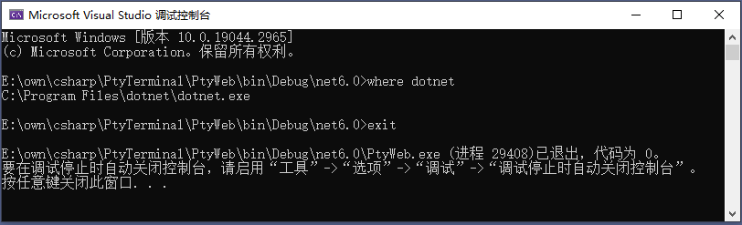
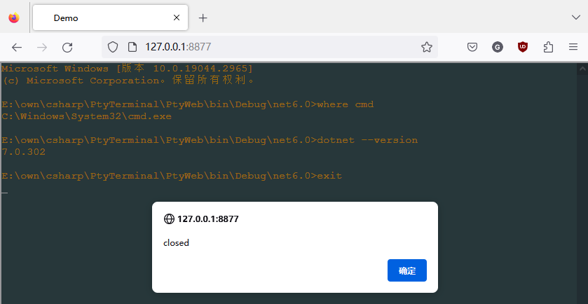
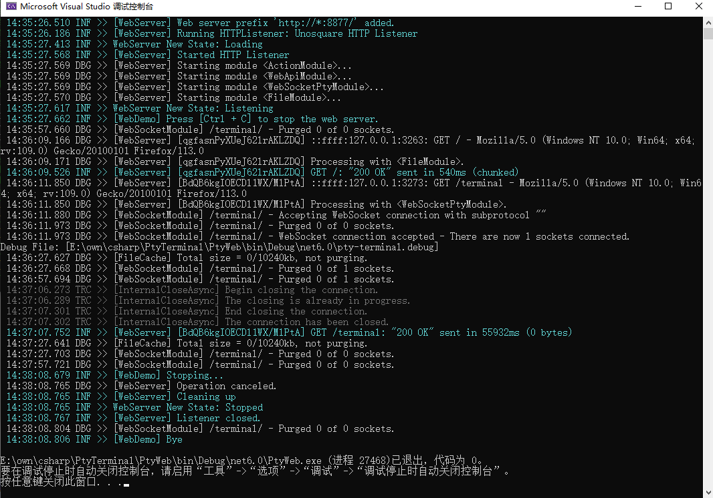

[](https://www.nuget.org/packages/PTY/)

# PtyTerminal

[English](./README.md) | **简体中文**

.NET(C#) 跨平台的 [伪终端](https://baike.baidu.com/item/%E4%BC%AA%E7%BB%88%E7%AB%AF/6247439) 库, 及其使用示例

## 项目
#### **Pty.Net** .NET(C#) 跨平台的 [伪终端](https://baike.baidu.com/item/%E4%BC%AA%E7%BB%88%E7%AB%AF/6247439) 库。基于 [microsoft/vs-pty.net](https://github.com/microsoft/vs-pty.net/tree/main/src/Pty.Net) 修改而来, 并借鉴了 [WindowsGSM/SteamCMD.ConPTY](https://github.com/WindowsGSM/SteamCMD.ConPTY/tree/main/SteamCMD.ConPTY)。
- Windows 平台上兼容 `ConPTY` 和 `winpty`
- 在 Unix 平台上通过平台服务调用()接口 (`forkpty`、`ioctl`、`kill` 等)实现
    - 接口在 Linux 上由 `libc.so.6` 和 `libutil.so.1` 提供
    - 接口在 MacOs 上由 `libSystem.dylib` 提供
#### **PtyWeb**
- **CliDemo** Pty.Net 在控制台中使用示例

- **WebDemo** Pty.Net 在 Web 中的使用示例, 通过 [EmbedIO](https://github.com/unosquare/embedio) 和 [Xterm.js](https://github.com/xtermjs/xterm.js/) 实现



## 提示
- 修改 `Program.cs` 以切换要运行哪一个Demo:
    ```csharp
    namespace PtyWeb
    {
        class Program
        {
            static void Main(string[] args)
            {
                CliDemo.Run(); // Console demo

                // WebDemo.Run(args); // Web demo
            }
        }
    }
    ```
- TODO: WebDemo - 使用 [ASP.NET Core 中的 WebSocket 支持](https://learn.microsoft.com/zh-cn/aspnet/core/fundamentals/websockets) 替换 EmbedIO

## 参考
- [Windows 命令行：介绍 Windows 伪终端 (ConPTY)](https://devblogs.microsoft.com/commandline/windows-command-line-introducing-the-windows-pseudo-console-conpty/)
- Github: [rprichard/winpty](https://github.com/rprichard/winpty)
- Github: [microsoft/terminal](https://github.com/microsoft/terminal)
    - [src/winconpty](https://github.com/microsoft/terminal/tree/main/src/winconpty)
    - [samples/ConPTY](https://github.com/microsoft/terminal/tree/main/samples/ConPTY)
        - [MiniTerm](https://github.com/microsoft/terminal/tree/main/samples/ConPTY/MiniTerm/MiniTerm)
- Github [microsoft/node-pty](https://github.com/microsoft/node-pty)
- Github: [unosquare/embedio](https://github.com/unosquare/embedio)
    - [EmbedIO - WebSockets Example](https://unosquare.github.io/embedio/#websockets-example)
- Github: [xtermjs/xterm.js](https://github.com/xtermjs/xterm.js)
    - [XTERM.JS - Addons/attach](https://xtermjs.org/docs/api/addons/attach/)
- [平台调用服务 (Platform Invocation Services)](https://learn.microsoft.com/en-us/dotnet/standard/native-interop/pinvoke), 简称 `P/Invoke`
