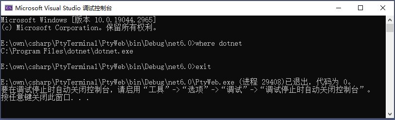
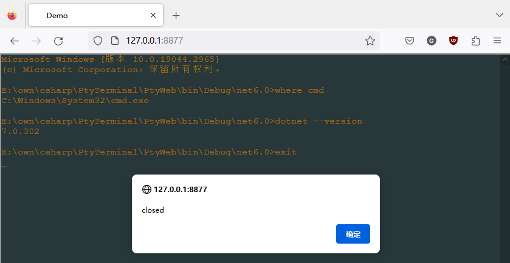
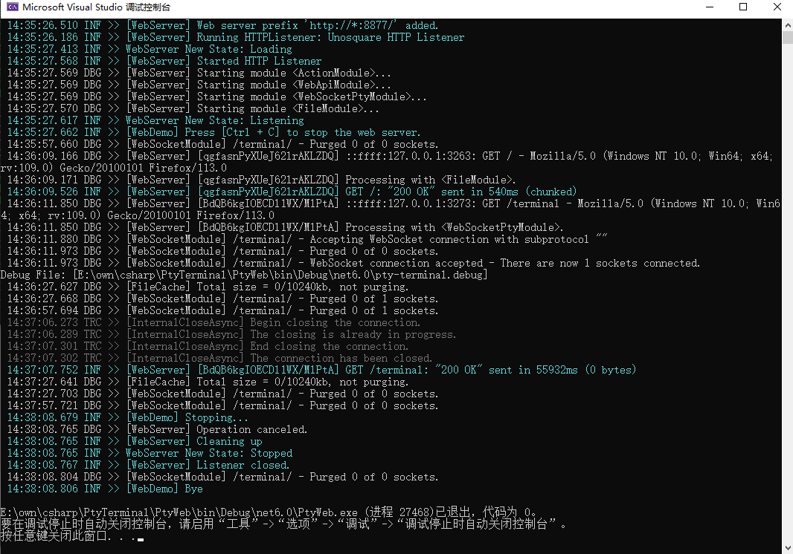

# PtyTerminal

 

PtyTerminal 的 Go 版本: [ptyterminal-go](https://github.com/gsw945/ptyterminal-go)

[English](./README.md) | **简体中文**

.NET(C#) 跨平台的 [伪终端](https://baike.baidu.com/item/%E4%BC%AA%E7%BB%88%E7%AB%AF/6247439) 库, 及其使用示例

## 项目
#### **Pty.Net** .NET(C#) 跨平台的 [伪终端](https://baike.baidu.com/item/%E4%BC%AA%E7%BB%88%E7%AB%AF/6247439) 库。基于 [microsoft/vs-pty.net](https://github.com/microsoft/vs-pty.net/tree/main/src/Pty.Net) 修改而来, 并借鉴了 [WindowsGSM/SteamCMD.ConPTY](https://github.com/WindowsGSM/SteamCMD.ConPTY/tree/main/SteamCMD.ConPTY)。
- Windows 平台上兼容 `ConPTY` 和 `winpty`
- 在 Unix 平台上通过平台调用服务 (Platform Invocation Services) 接口 (`forkpty`、`ioctl`、`kill` 等)实现
    - 接口在 Linux 上由 `libc.so.6` 和 `libutil.so.1` 提供
    - 接口在 MacOs 上由 `libSystem.dylib` 提供

#### examples
- **PtyCli** Pty.Net 在控制台中的使用示例
    - 将宿主编解码切换为 raw 模式, 按键以原始字节直接转发给 pty (与 web 版一致, 方向键/功能键/Ctrl+组合键/Alt+组合键/输入法均可正常工作)
    - 支持控制台窗口尺寸变化自动同步 (resize)
    - 运行: `dotnet run --project examples/PtyCli`

- **PtyWeb.EmbedIO** Pty.Net 在 Web 中的使用示例, 通过 [EmbedIO](https://github.com/unosquare/embedio) 和 [Xterm.js](https://github.com/xtermjs/xterm.js/) 实现
    - 运行: `dotnet run --project examples/PtyWeb.EmbedIO` (默认 <http://localhost:8877>)

- **PtyWeb.AspNetCore** 基于 [ASP.NET Core 中的 WebSocket 支持](https://learn.microsoft.com/zh-cn/aspnet/core/fundamentals/websockets) 的服务端示例
    - 与 EmbedIO 版使用相同的前端和线协议: 文本帧为 pty 输入, 二进制帧为 JSON 指令 (如 resize)
    - 运行: `dotnet run --project examples/PtyWeb.AspNetCore` (默认 <http://localhost:8878>, WebSocket 路径 `/terminal`)
- **PtyWeb.SignalR** 基于 [ASP.NET Core SignalR](https://learn.microsoft.com/zh-cn/aspnet/core/signalr/introduction) 的服务端示例
    - Hub 方法: 客户端调用 `Input(string)` / `Resize(cols, rows)`; 服务端推送 `Output(byte[])` / `Closed(exitCode)`
    - 运行: `dotnet run --project examples/PtyWeb.SignalR` (默认 <http://localhost:8879>, Hub 路径 `/terminalHub`)
- **PtySession** 基于 [ASP.NET Core 中的 WebSocket 支持](https://learn.microsoft.com/zh-cn/aspnet/core/fundamentals/websockets) 的 pty 会话管理示例
    - 会话独立于浏览器连接: 关闭页面后 pty 在服务端继续运行, 下次打开页面可从列表选择并恢复 xterm 交互 (输出按会话缓存 64KB, attach 时回放)
    - 会话销毁: 客户端显式销毁, 或 pty 进程退出 (如输入 `exit`) 时自动销毁
    - 线协议: 二进制帧为 JSON 指令 (list/create/attach/detach/destroy/resize), 文本帧为 pty 输入, 二进制输出 (含回放)
    - 运行: `dotnet run --project examples/PtySession` (默认 <http://localhost:8880>, WebSocket 路径 `/terminal`)

## 提示
- **输入必须 Flush**：`WriterStream` 是 PipeStream 实现（内部缓冲），写入后需调用 `FlushAsync` 输入才会真正到达 pty——请统一使用扩展方法 `PtyStreamExtensions.WriteInputAsync`（写入 + 刷新），避免输入丢失（参考 PtySession 调试经验）
- 各示例项目相互独立, 允许代码冗余, 便于单独阅读和修改
- PtyCli 退出方式: 在 pty 的 shell 中正常退出 (如输入 `exit`), 或关闭 shell 窗口; Ctrl+C 会作为按键转发给 pty 内的程序
- 四个 web 示例的默认端口: EmbedIO `8877`, AspNetCore `8878`, SignalR `8879`, PtySession `8880`, 均可用命令行第一个参数覆盖, 如 `dotnet run --project examples/PtyWeb.SignalR -- http://*:9000`

## 参考
- [Windows 命令行：介绍 Windows 伪终端 (ConPTY)](https://devblogs.microsoft.com/commandline/windows-command-line-introducing-the-windows-pseudo-console-conpty/)
- Github: [rprichard/winpty](https://github.com/rprichard/winpty)
- Github: [microsoft/terminal](https://github.com/microsoft/terminal)
    - [src/winconpty](https://github.com/microsoft/terminal/tree/main/src/winconpty)
    - [samples/ConPTY](https://github.com/microsoft/terminal/tree/main/samples/ConPTY)
        - [MiniTerm](https://github.com/microsoft/terminal/tree/main/samples/ConPTY/MiniTerm/MiniTerm)
- Github [microsoft/node-pty](https://github.com/microsoft/node-pty)
- Github: [unosquare/embedio](https://github.com/unosquare/embedio)
    - [EmbedIO - WebSockets Example](https://unosquare.github.io/embedio/#websockets-example)
- Github: [xtermjs/xterm.js](https://github.com/xtermjs/xterm.js)
    - [XTERM.JS - Addons/attach](https://xtermjs.org/docs/api/addons/attach/)
- [ASP.NET Core 中的 WebSocket 支持](https://learn.microsoft.com/zh-cn/aspnet/core/fundamentals/websockets)
- [ASP.NET Core SignalR](https://learn.microsoft.com/zh-cn/aspnet/core/signalr/introduction)
- [平台调用服务 (Platform Invocation Services)](https://learn.microsoft.com/en-us/dotnet/standard/native-interop/pinvoke), 简称 `P/Invoke`